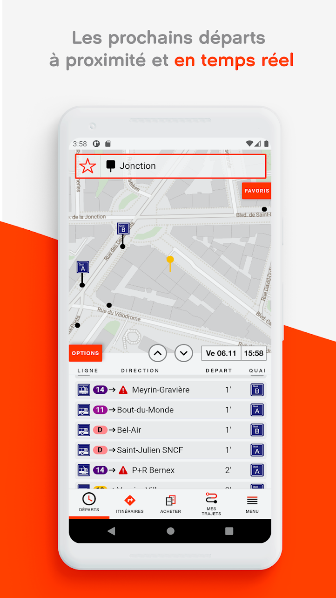

# Hello, world! ;-)

## TLDR;

I am **Senior full stack developer** with a broad knowledge of **software development**.

**19 years of total experience** in software development including **8 years with modern stacks like React, Node.js and MongoDB**. 

Used to work with Node.js, Express, MongoDB, ES6, Typescript, Angular, React or Next.js. 

Led small teams of software engineers.

Created entire cloud based or on-premise APIs based on message queues, SOAP, REST or GraphQL services. 

# Portfolio

## Professional apps and websites

### tpg, tl

- [tpgPreview](https://www.tpg.ch/fr/voyager/plus-de-mobilite/application-tpg) and [tl](https://www.t-l.ch/abos-billets/billets/ebillets) are the mobile apps that are used by thousands of users around Geneva (tpg) and Lausanne (tl). It helps them find their itineraries by bus or train along with buying their e-tickets from their mobile phone.
- Front-end Developer: developing new screens of the main app (Ionic, Angular)
- + evaluating interactions with others external (React native)
- Back-end Developer: improving the back-end (NestJs, GraphQL, MongoDB)
- DevOps: hosting the solution on AWS (EKS), configuring Gitlab (OVH) and Gitlab runners (EC2)
- L3 support (JIRA)

### PrestoPark

- [PrestoPark](https://prestopark.com/) is a range of e-services for motorists using paid on-street parking. Helps finding parking spot by guiding motorists to vacant parking spaces and offering them in payment solutions with fully paperless parking tickets.
- Front-end Developer: developed the main website (AngularJS)
- Back-end Developer: developed the backend for frontend API (Express) and the external API (Loopback) used by external parking providers like Easypark, Paybyphone, Parkeon, etc. or the French government agency ANTAI.
- DevOps: configured the CI/CD (Gitlab) that uses runners (on premises + OVH) to autodeploy to AWS (ElasticBeanstalk).

### Parking Val d'Isère

- [Parking Val d'Isère](https://www.parkingvaldisere.com/) is the off-street parking solution for Val d'Isère. It is used by seasonal motorists to access the parking during each winter seasons.
- Front-end Developer: developed the main website as a variation of PrestoPark (AngularJS) + the admin dashboard (React) to manage the bookings
- Back-end Developer: developed the backend for frontend API (Express) and the external API (Loopback) used by the external parking provider Skidata

## Hobbies

On my free time, I create web applications that makes use of the latest modern stacks.

## CryptoScore

[CryptoScore](https://www.thetradingteam.link/)

- Front-end Developer: developed pages and components using Next.js and React
- State management using Redux
- UI framework [Material-UI](https://material-ui.com/)
- Back-end Developer: development AWS Lambda functions to fetch the data from MongoDB and expose them to API endpoints (API Gateway)
- DevOps: configured the CI/CD that makes use of Github, SAM CLI and AWS CloudFormation

Example of a screen: https://www.thetradingteam.link/en/dashboard/top10
- The scores are computed using AWS SQS queues to guarantee the completeness of the scraped data from the Coingecko API.
- Alerts are sent by e-mail using AWS SNS notifications.

## Let's Pay Crypto!

[Let's Pay Crypto](https://letspaycrypto.com/) is a web3 dApp that helps people to share their expenses during friend gatherings.

- Front-end Developer: developed pages and components using Next.js and React
- State management using Redux
- UI framework [Material-UI](https://material-ui.com/)
- Back-end Developer: developed Moralis functions to manage the user data

# Github projects

A selection of my public Github projects:

- [Gate.io automated trader in NodeJS
](https://github.com/sovattha/gateio-ws): Simple NodeJS project using the Gate.io API websockets and a Cassandra database hosted on Datastax.
- [Gate.io API for Next.js](https://github.com/sovattha/gateio-nextjs): Simple wrapper around the Gate.io API to be run on Next.js.
- [Next Right Now](https://github.com/sovattha/next-right-now): Some minor contributions to the awesome framework [Next Right Now](https://github.com/UnlyEd/next-right-now)
- [Vimeo player component for React](https://github.com/sovattha/react-vimeo): Some minor contributions to allow backward compatibility
- [WhatColour](https://github.com/sovattha/WhatHouse): What colour are you?
- [Magic: The Gathering deck editor](https://github.com/sovattha/mtg): A simplistic deck editor of Magic cards
